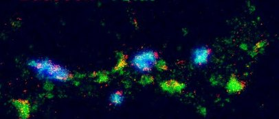
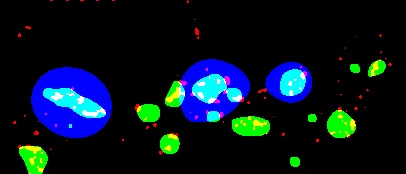
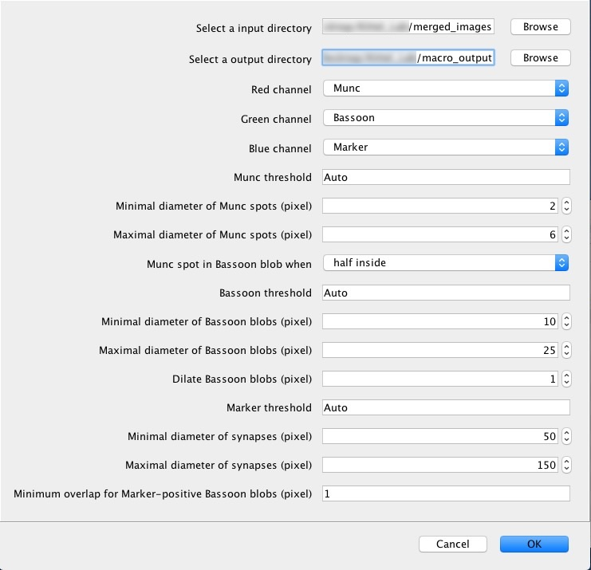
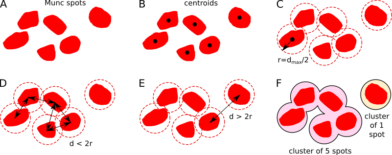

# MuncOnBassoon
FIJI Macro for counting Munc spots on Bassoon blobs.

|example data|segmentation result|
|--------------------------------|-----------------------------------|
| |  |

## Usage



1. The minimal diameters are used to average out noise, the maximal diameter is used to subtract the background. All of these diameters are measured in pixels.
2. All Munc spots that are closer than a specified maximal distance (in pixels) are part of the same cluster. The distance can be measured between the borders of the segmented Munc spots, their centroids or their skeletons.
3. It is recommended check the literature and convert these values to pixels depending on the scaling of the images. For instance, [Sakamoto et al., 2018](https://www.nature.com/articles/s41593-017-0042-8) reported 44.9 ± 12.0 nm for Munc spot diameter (1.) and 84.7 ± 22.7 nm for their distance within clusters (2.).
4. It is recommended to first use the Auto threshold feature and check the used thresholds (see note on results below). Then calculate the average threshold for each channel over all images and explore different thresholds close to that average value until the segmentations looks fine.

## Note on data

This script will process any image found in the specified input folder.

## Note on results

For each input file  this script produces three output files, which will be written to the specified output folder. For example, the results for an image named `example_data.tif` will be found in:

1. `example_data.tif.bassoon.csv` contains comma delimited values for `Bassoon_id`, `Bassoon_area`, `Marker_overlap`, `Munc_count` and `Munc_density`. The `Bassoon_id=0` refers to the background.

| Bassoon_id | Bassoon_area | Marker_overlap | Munc_count | Munc_density |
|------------|--------------|----------------|------------|--------------|
| 0          | 65304        | 0              | 41         | 6.278E-4     |
| 1          | 216          | 0              | 1          | 0.005        |
| 2          | 79           | 0              | 0          | 0.000        |
| 3          | 561          | 1              | 5          | 0.009        |
| 4          | 888          | 1              | 6          | 0.007        |
| ..         | ..           | ..             | ..         | ..           |
| 14         | 88           | 0              | 0          | 0.000        |

2. `example_data.tif.munc.csv` contains comma delimited values for `Munc_id`, `Munc_area`, `Munc_x`, `Munc_y`, `Munc_mean`, `Bassoon_id`, and `Cluster_id`.

|Munc_id|Munc_area|Munc_x |Munc_y |Munc_mean|Bassoon_id|Cluster_id|
|-------|---------|-------|-------|---------|----------|----------|
|1      |95       |375.247|67.405 |85.326   |1         |1         |
|2      |87       |303.017|75.753 |90.897   |3         |2         |
|3      |76       |225.934|80.434 |108.434  |4         |3         |
|4      |237      |176.614|92.673 |122.186  |5         |0         |
|5      |31       |202.952|84.242 |93.613   |4         |3         |
|..     |..       |..     |..     |..       |..        |..        |
|17     |33       |168.591|148.015|87.242   |14        |9         |

3. `example_data.tif.cluster.csv` contains comma delimited values for `Cluster_id`, `Marker_overlap`, `Munc_count`. The `Cluster_id=0` refers to the background.

|Cluster_id|Marker_overlap|Munc_count|
|----------|--------------|----------|
|0         |0             |2         |
|1         |0             |1         |
|2         |1             |1         |
|3         |1             |4         |
|4         |1             |0         |
|..        |..            |..        |
|10        |0             |1         |

4. `example_data.tif.segmented.png` contains all segmented Munc spots, Bassoon blobs and segmented pre-synapses based on the marker channel. Additional white outlines indicate the Munc clusters.  

5. `example_data.tif.compare.png` shows the input image side by side with the segmented images.

6. `example_data.tif.parameters.yaml` contains all parameters used for the segmentation of the image which were provided by the user dialog. Note, that it contains the used `threshold` values as well as the method used for `thresholding` (`Auto` or `Fixed`). Furthermore it contains the  `cluster_distance` as well as the method of measuring the `distance_between` the Munc spots for  clustering.

```yaml
channels:
   red: Munc
   green: Bassoon
   blue: Marker
Munc:
   threshold: 22
   thresholding: Auto
   min_diameter: 6
   max_diameter: 12
   cluster_distance: 24
   distance_between: Centroids
Bassoon:
   threshold: 35
   thresholding: Auto
   min_diameter: 10
   max_diameter: 25
   dilations: 0
Marker:
   threshold: 10
   thresholding: Auto
   min_diameter: 50
   max_diameter: 150
```


After all images are processed, another file is created: `used_thresholds.csv` contains comma delimitted values for `used_filenames`, `used_threshold_Munc`, `used_threshold_Bassoon` and `used_threshold_Marker`.

| input_filename   | used_threshold_Munc | used_threshold_Bassoon | used_threshold_Marker |
|------------------|---------------------|------------------------|-----------------------|
| test_example.tif | 34                  | 35                     | 10                    |


## Note on clustering



Munc spots are clustered if the `distance_between` the Munc spots is below a specified `cluster_distance`. For instance, if the `distance_between` the Munc spots (A) is measured between their centroids (B), a circle with the radius half on the `distance_between` (d_max) is drawn around them (C). Munc spots belong to the same cluster if their circles overlap (D), otherwise not (E). Therefore each cluster contains 1 or more Munc spots (F).

## Note on test data
* The `example_data.tif` STORM image in the `doc` folder is a copy of figure panel 5B from the following publication. It has been made available via CC BY 3.0. Please note that this is not a labelling by Munc and Bassoon.
```
Andreska, T., Aufmkolk, S., Sauer, M., & Blum, R. (2014). High abundance of BDNF within glutamatergic presynapses of cultured hippocampal neurons. Frontiers in cellular neuroscience, 8, 107.
```
* The `test_example.tif` swapped the red and and the blue channel. Also added was third, blue channel containing the signal from an additional synapse marker with low resolution as typical for standard epifluorescence microscopy. This image is only for testing purposes.   
