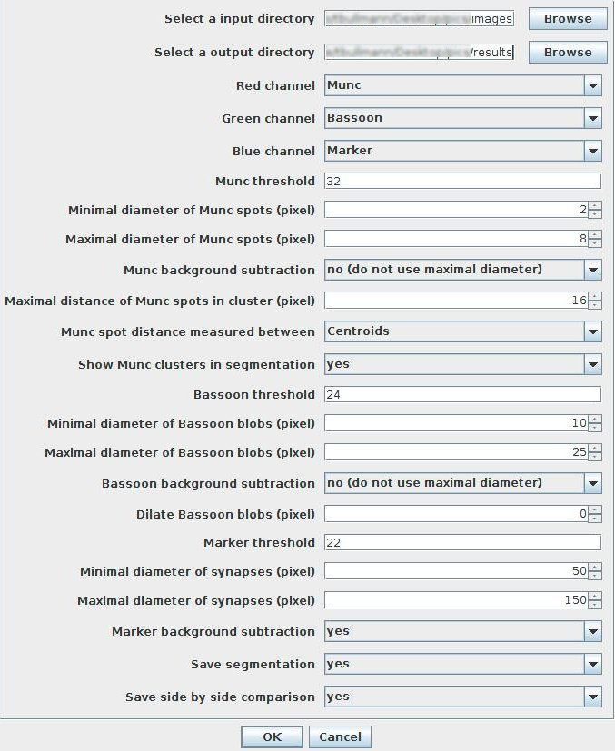

# MuncOnBassoon
FIJI Macro for counting Munc spots on Bassoon blobs.

|example data|segmentation result|
|--------------------------------|-----------------------------------|
| |  |

## Usage



## Note on data

This script will process any image found in the specified input folder.

## Note on results

For each input file  this script produces three output files, which will be written to the specified output folder. For example, the results for an image named `example_data.tif` will be found in:

1. `example_data.tif.bassoon.csv` contains comma delimitted values for `Basson_id`, `Basson_area`, `Marker_mean`, `Munc_count` and `Munc_density`. The `Bassoon_id=0` referes to the background.

|Basson_id|Basson_area|Marker_mean|Munc_count|Munc_density|
|---------|-----------|-----------|----------|------------|
|0        |64374      |0.000      |9         |1.398E-4    |
|1        |290        |30.034     |1         |0.003       |
|2        |121        |29.025     |0         |0.000       |
|3        |526        |163.224    |2         |0.004       |
|4        |1055       |143.863    |6         |0.006       |
|..       |..         |..         |..        |..          |
|17       |98         |32.265     |0         |0.000       |

2. `example_data.tif.munc.csv` contains comma delimitted values for `Munc_id`, `Munc_area`, `Munc_mean`, and `Bassoon_id`.

|Munc_id|Munc_area|Munc_mean|Bassoon_id|
|-------|---------|---------|----------|
|1      |36       |73.583   |0         |
|2      |88       |93.341   |1         |
|3      |63       |110.952  |3         |
|4      |59       |124.678  |0         |
|5      |209      |132.947  |5         |
|..     |..       |..       |..        |
|31     |16       |105.938  |0         |

3. `example_data.tif.segmented.tif` contains all segmented munc spots, all segmented bassoon blobs as well as the original marker channel.


## Note on test data
* The `example_data.tif` STORM image in the `doc` folder is a copy of figure panel 5B from the following publication. It has been made available via CC BY 3.0. Please note that this is not a labelling by Munc and Bassoon.
```
Andreska, T., Aufmkolk, S., Sauer, M., & Blum, R. (2014). High abundance of BDNF within glutamatergic presynapses of cultured hippocampal neurons. Frontiers in cellular neuroscience, 8, 107.
```
* The `test_example.tif` swapped the red and and the blue channel. Also added was third, blue channel containing the signal from an additional synapse marker with low resolution as typical for standard epifluorescence microscopy. This image is only for testing purposes.   
